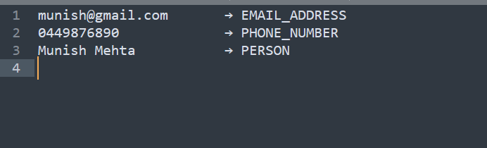
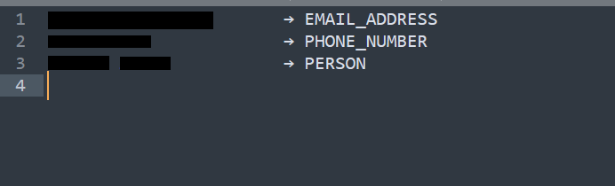

# Local Redact

[](https://github.com/mumehta/local-redact/actions/workflows/ci.yml)

A local command-line redaction tool that removes personally identifiable information (PII), DevOps secrets, API keys, tokens, credentials, and other sensitive values from text files and images. It is built on top of [Microsoft Presidio](https://github.com/microsoft/presidio).

The Python distribution is named `local-redactor` (on PyPI); the installed command is `redact`.

The goal of this project is to provide a simple command such as:

```bash
redact sensitive-file.txt
redact screenshot.png
```

which creates sanitized copies that are safer to share in public forums, GitHub issues, support tickets, AI tools, documentation, and other external systems.

The project is designed to run locally so that the original sensitive data does not need to be uploaded to a third-party redaction service.

It runs on **Windows, macOS, and Linux**. The tool installs as a proper Python package with a `redact` console command, so the same command works identically on every operating system. Only the system prerequisites (Tesseract OCR, the spaCy model) differ per OS.

## Image Redaction Example

| Before | After |
| --- | --- |
|  |  |

## Related Posts

- [LinkedIn post about Local Redactor](https://lnkd.in/p/ghje9qJn)
- [Redact Sensitive Data Locally Before Sharing With AI](https://www.munish-mehta.com/post/redact-sensitive-data-locally-before-sharing-with-ai/)
- [Before You Paste Logs Into AI, Redact Them Locally](https://medium.com/cyber-threat-diaries/before-you-paste-logs-into-ai-redact-them-locally-9aa56c023b1a)

---

## Why This Project Exists

Engineers regularly need to share:

- Application logs
- Terminal output
- Configuration files
- JSON/YAML
- Error messages
- Screenshots
- Debugging information
- Infrastructure configuration
- Support diagnostics

These files can unintentionally contain sensitive information such as:

- Names
- Email addresses
- Phone numbers
- IP addresses
- URLs
- Account identifiers
- Authentication tokens
- API keys
- Cloud credentials
- Private keys
- Connection strings

Manually finding and redacting every sensitive value is slow and error-prone.

This project provides a local automated redaction layer before information is shared externally.

---

# Current Status

The current version supports text-based files using:

- Presidio Analyzer
- Presidio Anonymizer
- spaCy
- `en_core_web_lg`

It also supports PNG/JPG/JPEG image redaction using:

- Presidio Image Redactor
- Tesseract OCR
- pytesseract

DevOps-specific secret detection is implemented with custom recognizers for common infrastructure credentials, API keys, tokens, private keys, and connection strings.

The project ships as an installable Python package (`local-redactor`) with a `redact` console entry point.

---

# Architecture

## Text Redaction

```text
Input file
    |
    v
Presidio Analyzer
    |
    +-- Pattern recognizers
    |
    +-- spaCy NLP model
    |
    v
Detected entities
    |
    v
Presidio Anonymizer
    |
    v
Redacted output file
```

Example:

```text
user-pii.txt
        |
        v
Presidio Analyzer
        |
        v
PERSON
EMAIL_ADDRESS
PHONE_NUMBER
        |
        v
Presidio Anonymizer
        |
        v
user-pii.redacted.txt
```

## Image Redaction

```text
Screenshot
    |
    v
Tesseract OCR
    |
    v
Extracted text + coordinates
    |
    v
Presidio Analyzer
    |
    v
Sensitive entities
    |
    v
Presidio Image Redactor
    |
    v
Opaque redaction boxes
    |
    v
screenshot.redacted.png
```

---

# Prerequisites

Two things are required on every operating system and **cannot** be installed by
`pip`, so they are installed per-OS below:

1. **Python 3.9 or newer**
2. **Tesseract OCR** (only needed for image redaction)

A third requirement, the spaCy language model, is installed with the same
command on every OS after the Python package is installed (see
[Installation](#installation)).

Pick your operating system:

- [Windows prerequisites](#windows-prerequisites)
- [macOS prerequisites](#macos-prerequisites)
- [Linux (Ubuntu/Debian) prerequisites](#linux-ubuntudebian-prerequisites)

---

## Windows prerequisites

### Python

Install from [python.org](https://www.python.org/downloads/) or with winget:

```powershell
winget install -e --id Python.Python.3.12
python --version
```

### Tesseract OCR

Tesseract is a native system dependency and is **not installed by pip**.

```powershell
winget install -e --id tesseract-ocr.tesseract
```

A typical installation location is:

```text
C:\Program Files\Tesseract-OCR
```

Verify:

```powershell
tesseract --version
tesseract --list-langs
```

At minimum, the English language model (`eng`) should be listed.

If Windows cannot find `tesseract` after installation, either add
`C:\Program Files\Tesseract-OCR` to your `PATH`, or point the redactor at the
binary directly with the `TESSERACT_CMD` environment variable:

```powershell
$env:TESSERACT_CMD = "C:\Program Files\Tesseract-OCR\tesseract.exe"
```

---

## macOS prerequisites

### Python

macOS ships with Python 3, but a dedicated install via
[Homebrew](https://brew.sh/) is recommended:

```bash
brew install python
python3 --version
```

### Tesseract OCR

```bash
brew install tesseract
tesseract --version
tesseract --list-langs
```

Homebrew places `tesseract` on your `PATH` automatically. If you installed it
somewhere non-standard, point the redactor at it explicitly:

```bash
export TESSERACT_CMD="/opt/homebrew/bin/tesseract"
```

---

## Linux (Ubuntu/Debian) prerequisites

### Python

```bash
sudo apt update
sudo apt install -y python3 python3-venv python3-pip
python3 --version
```

### Tesseract OCR

```bash
sudo apt install -y tesseract-ocr
tesseract --version
tesseract --list-langs
```

For other distributions, use the equivalent package
(for example `sudo dnf install tesseract` on Fedora). If `tesseract` is not on
your `PATH`, set `TESSERACT_CMD` to its full path:

```bash
export TESSERACT_CMD="/usr/bin/tesseract"
```

---

# Installation

The steps below are the same on every OS once the
[prerequisites](#prerequisites) are in place. Windows users can run the same
commands in PowerShell (adjusting only the virtual-environment activation line,
noted below).

## 1. Clone the repository

```bash
git clone https://github.com/mumehta/local-redact.git
cd local-redact
```

## 2. Create and activate a virtual environment

A dedicated virtual environment keeps Presidio, spaCy, OpenCV, OCR libraries,
and their dependencies isolated from system-wide Python packages.

Create it:

```bash
python3 -m venv .venv
```

Activate it:

**macOS / Linux**

```bash
source .venv/bin/activate
```

**Windows (PowerShell)**

```powershell
.\.venv\Scripts\Activate.ps1
```

Your prompt should now be prefixed with `(.venv)`.

## 3. Upgrade pip

```bash
python -m pip install --upgrade pip
```

## 4. Install the package

Install the project (and its pinned dependencies) into the virtual environment.
This also creates the `redact` command.

```bash
python -m pip install .
```

For development (editable install plus test dependencies):

```bash
python -m pip install -e ".[dev]"
```

## 5. Install the spaCy English model

This command is identical on every OS:

```bash
python -m spacy download en_core_web_lg
```

Verify:

```bash
python -m spacy validate
```

`en_core_web_lg` should be listed as compatible.

## 6. Verify the installation

```bash
redact --help
```

You should see the CLI usage. Optionally verify the underlying engines:

```bash
python -c "from presidio_analyzer import AnalyzerEngine; a=AnalyzerEngine(); print([r.entity_type for r in a.analyze(text='My name is John Smith and my email is john@example.com', language='en')])"
python -c "import pytesseract; print(pytesseract.get_tesseract_version())"
```

---

# The `redact` Command

Installing the package with `pip install .` (or `pip install -e .`) creates a
real `redact` executable on every operating system:

- On **Windows**, pip generates `redact.exe` in the environment's `Scripts`
  directory.
- On **macOS/Linux**, pip generates a `redact` executable in the environment's
  `bin` directory.

No hand-written wrapper script is required. This replaces the older Windows-only
`redact.cmd` approach (see [Legacy Windows wrapper](#legacy-windows-wrapper) if
you still want a global command that does not require activating the virtual
environment).

## Install globally with pipx (recommended for everyday use)

[pipx](https://pipx.pypa.io/) installs the command into an isolated environment
and puts `redact` on your `PATH`, so you never have to activate a virtual
environment to use it. This works the same on Windows, macOS, and Linux.

Install the published release from PyPI:

```bash
pipx install local-redactor
```

Or install from a local clone (for unreleased changes):

```bash
pipx install .
```

Then, from anywhere:

```bash
redact application.log
redact screenshot.png
```

You still need Tesseract and the spaCy model installed as described in
[Prerequisites](#prerequisites) and [Installation](#installation). When using
pipx, the spaCy model must be downloaded into the pipx-managed environment for
`local-redactor` (pipx isolates each app, so a model installed elsewhere is not
visible to it):

```bash
pipx runpip local-redactor -- python -m spacy download en_core_web_lg
```

---

# Using the Redactor

With the virtual environment activated (or after `pipx install`), run:

```bash
redact ./example.txt
```

The tool creates:

```text
example.redacted.txt
```

The original file is left unchanged.

## Display detected entities

```bash
redact ./example.txt --show-detections
```

Example:

```text
Detections:

PERSON               score=0.85 position=11:21
EMAIL_ADDRESS        score=1.00 position=38:54
PHONE_NUMBER         score=0.75 position=71:86
```

This is useful when testing detection accuracy.

## Specify an output file

```bash
redact ./example.txt -o ./safe-to-share.txt
```

## Overwrite an existing redacted file

By default, the tool will not overwrite an existing output file. Use `--force`
when intentional overwriting is required:

```bash
redact ./example.txt --force
```

## Image redaction

```bash
redact screenshot.png
```

produces:

```text
screenshot.redacted.png
```

Supported image formats: `.png`, `.jpg`, `.jpeg`.

If Tesseract is not installed or not on your `PATH`, the tool prints a clear
error with the correct install command for your OS. You can also point it at a
specific Tesseract binary with the `TESSERACT_CMD` environment variable.

---

# Supported Text Files

The current implementation supports text-based formats including:

```text
.txt
.log
.json
.yaml
.yml
.env
.conf
.config
.ini
.xml
.csv
.md
```

Files are expected to contain UTF-8 text.

Structured formats such as JSON, YAML, XML, `.env`, and `.ini` are redacted
as text. The tool preserves useful structure in many common cases, but it
does not parse and reserialize these formats yet, so review generated output
before using it as machine-readable configuration.

---

# Example

Input:

```text
My name is John Smith.
My email address is john@example.com.
My phone number is +61 412 345 678.
```

Run:

```bash
redact example.txt
```

Output (`example.redacted.txt`):

```text
My name is <PERSON>.
My email address is <EMAIL_ADDRESS>.
My phone number is <PHONE_NUMBER>.
```

---

# Dependency Management

Dependencies are declared in `pyproject.toml`:

- Runtime dependencies live under `[project].dependencies`.
- Development/test dependencies live under
  `[project.optional-dependencies].dev` and are installed with
  `pip install -e ".[dev]"`.

Two supporting files remain for convenience:

## `requirements.txt`

The direct runtime dependencies, mirroring `pyproject.toml`, for environments
that prefer a plain requirements file:

```text
presidio-analyzer==2.2.364
presidio-anonymizer==2.2.364
presidio-image-redactor==0.0.60
```

## `requirements-lock.txt`

Captures the complete known-working Python environment, including transitive
dependencies. Regenerate it with:

```bash
python -m pip freeze > requirements-lock.txt
```

Use it when an exact environment needs to be reproduced:

```bash
python -m pip install -r requirements-lock.txt
```

---

# Development And Tests

Install the project with development dependencies:

```bash
python -m pip install -e ".[dev]"
```

Run the automated tests:

```bash
python -m pytest
```

The tests use synthetic PII and credential-shaped fixtures only. Image tests use
fakes/mocks and do not require Tesseract to be installed.

---

# System Dependencies

Some dependencies cannot be represented in `pyproject.toml` and are installed
per-OS (see [Prerequisites](#prerequisites)):

```text
Tesseract OCR 5.x
```

The spaCy language model is also installed separately (same command on all
operating systems):

```bash
python -m spacy download en_core_web_lg
```

---

# Security Considerations

## Automated redaction is not a security guarantee

The output of this tool should **not automatically be assumed safe for public disclosure**.

PII and secret detection systems can produce:

- False positives
- False negatives
- Incorrect entity boundaries
- OCR errors
- Unrecognized credential formats

Review highly sensitive output before publishing it.

## DevOps Secrets

Standard Presidio recognizers are primarily designed for PII.

Infrastructure and DevOps material may contain secrets that are not detected by default, including:

```text
AWS_ACCESS_KEY_ID
AWS_SECRET_ACCESS_KEY

ghp_...
github_pat_...

Authorization: Bearer ...

JWT tokens

client_secret=...

password=...

N8N_ENCRYPTION_KEY=...

privkey:...

nlpriv:...

Kubernetes secrets

database connection strings

SSH/private keys

OAuth credentials

cloud provider credentials
```

Custom recognizers cover many of these patterns, but manually inspect infrastructure-related output before sharing it publicly.

## Current Limitations

- Files are processed one at a time; directory/batch redaction is not implemented yet.
- Text files must be UTF-8 encoded.
- JSON, YAML, XML, `.env`, `.ini`, and similar files are processed as text, not parsed as structured data.
- OCR accuracy depends on screenshot quality, font size, contrast, and layout.
- Detection is best-effort and can miss unfamiliar token formats or redact too much context.

---

# Legacy Windows wrapper

Before the project was packaged with a console entry point, Windows users
exposed a global `redact` command with a small `.cmd` wrapper that called the
virtual environment's Python directly. This is **no longer necessary** — use
`pip install .` or `pipx install .` instead, which produce a `redact` command
on every OS.

The wrapper is documented here only for historical reference. If you still want
a wrapper that invokes the project without activating the virtual environment,
create `C:\Users\<username>\bin\redact.cmd`:

```bat
@echo off
"C:\path\to\local-redact\.venv\Scripts\python.exe" -m presidio_redactor.cli %*
```

and add `C:\Users\<username>\bin` to your user `PATH`.

---

# Repository Structure

```text
local-redact/
|
+-- .github/
|   +-- workflows/
|       +-- ci.yml               # cross-OS test matrix
|       +-- release.yml          # build + PyPI trusted publishing on v* tags
|
+-- .gitignore
+-- LICENSE                      # MIT
+-- README.md
+-- pyproject.toml               # packaging, deps, `redact` entry point
+-- requirements.txt
+-- requirements-lock.txt
+-- requirements-dev.txt
|
+-- src/
|   +-- presidio_redactor/
|       +-- __init__.py
|       +-- cli.py               # argparse + main(); the `redact` command
|       +-- text.py              # text redaction pipeline
|       +-- image.py             # image redaction + Tesseract resolution
|       +-- recognizers/
|           +-- __init__.py
|           +-- devops.py        # custom DevOps/secret recognizers
|
+-- tests/
|   +-- fixtures/
|   +-- test_devops_recognizers.py
|   +-- test_image_redaction.py
|   +-- test_text_redaction.py
|   +-- test_tesseract_resolution.py
|
+-- user-pii.txt                 # synthetic local example
+-- user-pii.redacted.txt        # synthetic redacted example
|
+-- .venv/                       # ignored by Git
```

---

# Planned Features

Future development includes:

- Content-based file type detection
- Broader OAuth token detection
- Broader GCP/Azure credential detection
- GitLab token detection
- Format-aware Kubernetes Secret parsing
- Batch directory redaction
- Dry-run mode
- Configurable entity selection
- Confidence thresholds
- Windows Explorer "Redact before sharing" integration

---

# Development Roadmap

The recommended implementation order is:

```text
1. Text PII redaction                 DONE
        |
2. Global redact command              DONE
        |
3. Tesseract installation             DONE
        |
4. Image redaction                    DONE
        |
5. DevOps secret recognizers          DONE
        |
6. Automated synthetic tests          DONE
        |
7. Cross-platform support             DONE
        |
8. Python CLI packaging               DONE
        |
9. CI + PyPI release automation       DONE
        |
10. Batch redaction
        |
11. Windows Explorer integration
```

---

# Git Safety

> **Test-data notice:** All names, email addresses, phone numbers, passwords,
> tokens, credentials, connection strings, and other sensitive-looking values
> committed in `tests/fixtures/`, `user-pii.txt`, and
> `user-pii.redacted.txt` are synthetic dummy data. They are deliberately
> shaped like real PII and secrets to exercise the redaction pipeline. They
> are not valid credentials and are not associated with real accounts.
> Automated secret scanners may still flag these fixtures because their
> formats intentionally resemble real credentials.

Never commit real sensitive data simply to test the redactor.

Avoid committing:

```text
.env
real application logs
credentials
private keys
access tokens
unredacted screenshots
production configuration
customer information
personal information
```

Use synthetic test data instead.

Do not rely on `.gitignore` as a security boundary. A file that has already been committed remains in Git history even if it is subsequently added to `.gitignore`.

---

# Privacy Model

The primary design principle of this project is:

> Sensitive source material should remain local wherever possible.

## No data leaves your machine at runtime

Unlike an online redaction service, the entire redaction pipeline runs locally.
When you invoke `redact`, your files are read, analyzed, and written on your own
machine. **No file content, detected entities, or redaction results are
transmitted over the network.** The tool does not collect telemetry, usage data,
or analytics of any kind.

## Network activity during setup only

Network access occurs only during initial installation and model download:

- `pip install` / `pipx install` fetches Python packages from PyPI.
- `python -m spacy download en_core_web_lg` downloads the NLP model (~400 MB)
  from GitHub/spaCy's CDN.

Once installed, the tool operates fully offline. If your environment requires
air-gapped operation, you can pre-download the wheel and spaCy model, transfer
them via removable media, and install from local files.

## Third-party dependencies

This project relies on open-source libraries (Microsoft Presidio, spaCy,
Pillow, pytesseract, and their transitive dependencies). Their privacy
behavior is governed by their respective projects. None of these libraries are
known to transmit user data at runtime, but this project does not control their
code.

## Image redaction uses opaque pixel replacement

Sensitive regions in images are overwritten with solid-colored boxes, not blurred.
This means the original pixel data is destroyed in the output file and cannot be
recovered, unlike Gaussian blur which can sometimes be reversed.

## Redacted output still requires review

Redaction removes detected sensitive *values*, but surrounding context may still
reveal operational information (system names, endpoints, usernames, timestamps,
log structure). Users remain responsible for reviewing redacted output before
publishing or transmitting it, particularly for high-sensitivity material.

---

# License

This project is licensed under the [MIT License](LICENSE).

The key dependencies and their licenses:

| Dependency | License |
| --- | --- |
| Microsoft Presidio | MIT |
| spaCy | MIT |
| Tesseract OCR | Apache 2.0 |
| pytesseract | Apache 2.0 |
| Pillow | HPND (MIT-like) |

All dependency licenses are compatible with the MIT License.

---

# Acknowledgements

This project builds on:

- Microsoft Presidio
- spaCy
- Tesseract OCR
- pytesseract

These projects provide the underlying PII detection, natural-language processing, and optical character recognition capabilities.
